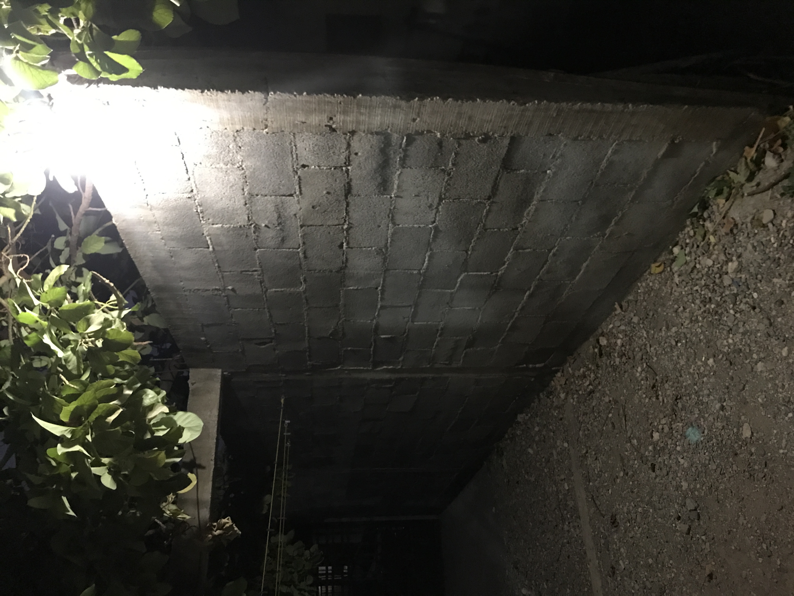
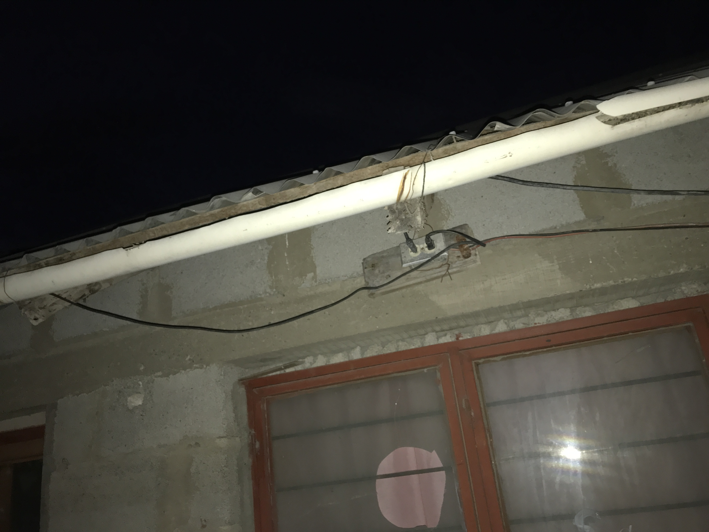

# IoTLight

This is an application solution for an IoTLight for a house.

## Porpuse of this project.
The main porpuse of this project is for apply all the knowledge gather in the Embebed Systems class in my university.

## Material

- 1 x ESP32, ESP8266, nodeMCU or any microprocessor with WiFi controller.
- lot of wires.
- 1 x light.
- 1 x light connector.
- 1 x relay.

## Setup

The first step is know where you will put your IoT Light, it could be in your yard, in your room, or wherever you whant.

For this example, I choose my yard.

This is the spot of the light in my yard.

and this is where the light is connected.